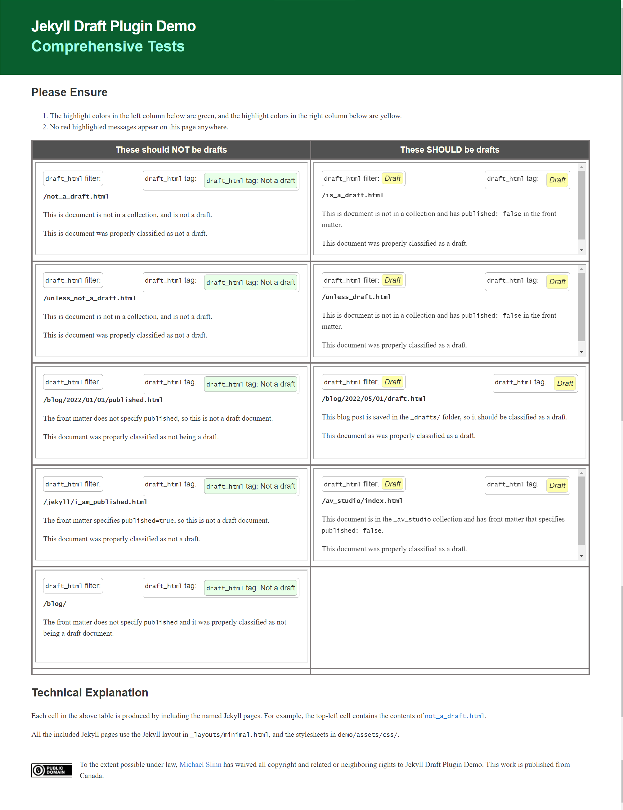

# jekyll_draft [](https://badge.fury.io/rb/jekyll_draft)

Jekyll has various ways of specifying that a page or document will be
visible when the website is published in `production` mode.
The Jekyll documentation is scattered and incomplete regarding detecting draft pages and documents.
This plugin provides standard ways for detecting draft pages and documents.

`Jekyll_draft` provides the following:

* Jekyll block tags: `if_draft`, `if_page_draft`, `unless_draft`, and `unless_page_draft`.
* Jekyll inline tags: `else_if_draft`, `else_if_page_draft`,
  `else_unless_draft` and `else_unless_page_draft`.
  These are meant for use within the above block tags.
  They are all identical; they are provided so usage seems natural.
* Jekyll inline tag `draft_html`, which generates HTML that indicates if
  the enclosing document or a specified is a draft.
* Liquid filters:
  * `is_draft` returns a boolean indicating if the document passed to it is a draft.
  * `page_match_is_draft` is like `is_draft`, but works on other pages.
  * `draft_html` returns the same string the `draft_html` tag returns,
    indicating if the <code>Jekyll::Page</code> passed to the filter is a draft.
  * `page_match_draft_html` is like `draft_html` but works on other pages.
    It accepts a string that will be matched against
    [`APage.href`](https://github.com/mslinn/jekyll_all_collections?tab=readme-ov-file#the-apage-class)
    values in <code>site.everything</code>.
* Module `Jekyll::Draft` defines an API that your plugin can call.
  It has the following methods:
  * `draft?` returns a boolean indicating if the object passed to it is a draft.
    It handles `AllCollectionsHooks::APage` instances, `Jekyll::Page` instances,
    and `Jekyll::Document` instances.
  * `draft_html` accepts the same parameter types as `draft?`,
    and returns the same string that `draft_html` tag returns.
    The response indicates if the document passed to it is a draft.
  * `page_match` returns the `APage` whose `href` uniquely ends with the string passed to it.
  * `root` returns the path to the root of the collection that the document passed to it is a member of.
    This method is not functionally related to Jekyll draft documents.

The difference between the tag called `draft_html` and the filter of the same name
is that the tag only works on the document that it is embedded in,
while the filter works on any document passed to it.
Both the tag and the filter call the same API methods defined in the `Jekyll::Draft` module.

More information is available on [Mike Slinn&rsquo;s website](https://www.mslinn.com/jekyll_plugins/jekyll_draft.html).


## Front Matter

To mark a blog as a draft, put it in the `_drafts` directory.

To mark any other article as a draft, add the following to its front matter:

```text
---
published: false
---
```


## Demo

The [demo/](demo) subdirectory has working examples of this Jekyll plugin's functionality
in a demonstration website.
It can be used to debug the plugin or it can run freely.
Please examine the <code>HTML</code> files in the demo to see how the plugin works.

To run the demo freely from the command line, type:

```console
$ demo/_bin/debug -r
```

Now point your web browser to http://localhost:4444.
You should see:



When the demonstration is running, any time you modify the <code>.html</code> files,
the demo website will regenerate.
Each time you make a change, the website instantly regenerates.
This helps the learning experience.

Please play with the contents of the <code>.html</code> files,
so you can learn how to write Jekyll pages that include this functionality.


## Installation

### For Use In A Jekyll Website

1. Add the CSS found in [`demo/assets/css/jekyll_draft.css`](demo/assets/css/jekyll_draft.css) to your Jekyll layout(s).

2. Add the following to your Jekyll website's `Gemfile`, within the `jekyll_plugins` group:

   ```ruby
   group :jekyll_plugins do
     gem 'jekyll_all_collections', '>= 0.3.8'
     gem 'jekyll_draft', '>=2.1.0'
   end
   ```

3. Type:

   ```shell
   $ bundle
   ```

4. Restart Jekyll.


### For Use In a Gem

1. Add the following to your gem&rsquo;s `.gemspec`:

   ```ruby
   spec.add_dependency 'jekyll_all_collections', '>= 0.3.8'
   spec.add_dependency 'jekyll_draft', '>=2.1.0'
   ```

2. Type:

   ```shell
   $ bundle
   ```


## Usage in a Web Page

This section documents the usage of the inline and block tags described [above](#top).

The `if_draft` and `if_page_draft` block tags act as `if-then` or `if-then-else` programming constructs.
Draft documents only exist in development mode.
In production mode, there is no way to programmatically detect if a draft document exists in development mode.

Thus, `if_draft` and `if_page_draft` actually mean "if in development mode and the document is a draft".

Furthermore, `unless_draft` and `unless_page_draft` actually mean "if in production mode or the document is not a draft".
These block tags act as Ruby
[`unless-then`](https://rubystyle.guide/#unless-for-negatives) and
[`unless-then-else`](https://rubystyle.guide/#no-else-with-unless) programming constructs.

The `draft_html` inline tag generates HTML that indicates if a page is a draft or not.


### `if_draft` and `unless_draft` Block Tags

These tags consider the status of the document that the tag is embedded in.

The <code>if_draft</code> block tag acts as an <code>if-then</code> or an <code>if-then-else</code> programming construct.

The following generates `<p>This is a draft document!</p>`
if the document it is embedded in is a draft,
and the Jekyll website generation was performed in development mode:

```html

  <p>This is a draft document.</p>

```

The following enhances the previous example by generating `<p>This is not a draft document!</p>`
if the document this code is embedded in is not a draft.
The message for the else clause is generated for documents that are not drafts,
regardless of whether Jekyll is in `production` or `development` mode.

```html

  <p>This is a draft document!</p>

  <p>This is not a draft document!</p>

```

The `unless_draft` block tag switches the then and else clauses of the `if_draft` block tag.
It acts as a Ruby [<code>unless-then</code>](https://rubystyle.guide/#unless-for-negatives) or
[<code>unless-then-else</code>](https://rubystyle.guide/#no-else-with-unless) programming construct.

```html

  <p>This is not a draft document!</p>

```

```html

  <p>This is not a draft document!</p>

  <p>This is a draft document!</p>

```


### `if_page_draft` and `unless_page_draft` Block Tags

These tags consider the status of the document whose url uniquely includes the specified string.

An error is raised in `development` mode if no page exists whose URL contains the matching string.

The following generates `<p><code>/directory/blah_blah.html</code> is a draft document!</p>`
if the rendered page with a url that ends with the string `blah.html` in is a draft,
and the Jekyll website generation was performed in development mode,
and the only page with a matching URL is <code>/directory/blah_blah.html</code>:

```html

  <p><code>{{matched_page.url}}</code> is a draft document.</p>

```

Notice the reference to a Jekyll variable called `matched_page` in the above example.
It is set to the Jekyll `Page` whose `url` uniquely matched the string following the `if_page_draft` tag.
This variable is only defined for `development` mode within the `then` clause of the `if_page_draft` tag,
and for the `else` clause of the `unless_page_draft` block tag.

You can specify any `Page` attribute with `matched_page`, for example {{matched_page.title}}.

The following generates `<p><code>/directory/blah_blah.html</code> is not a draft document!</p>`
if the `/directory/blah_blah.html` in is a draft document,
and the Jekyll website generation was performed in development mode:

```html

  <p><code>{{matched_page.url}}</code> is not a draft document!</p>

```

The following shows how to specify `else` clauses for `if_page_draft` and `unless_page_draft`.
Note that the `if_draft` else clause activates in `production` mode regardless of whether a page matches or not,
so you should not reference `matched_page` in an else clause without testing
[`jekyll.environment`](https://jekyllrb.com/docs/configuration/environments/).
Instead, you can reference the match string with `{{path_portion}}`:

```html

  <p><code>{{matched_page.url}}</code> is a draft document!</p>

  
    <p><code>{{matched_page.url}}</code> is not a draft document!</p>
  
    <p>Production mode cannot detect if <code>{{path_portion}}</code> matches a draft document or not.</p>
  

```

Similarly, the `unless_draft` then clause activates in `production` mode regardless of whether a page matches or not,
so you should not reference `matched_page` in a then clause without testing
[`jekyll.environment`](https://jekyllrb.com/docs/configuration/environments/).

```html

  
    <p>The page whose URL contains <code>{{path_portion}}</code> is not a draft document!</p>
  
    <p>Production mode cannot detect if <code>{{path_portion}}</code> matches a draft document or not.</p>
  

  <p><code>{{matched_page.url}}</code> is a draft document!</p>

```

As with the `if_page_draft` and `unless_page_draft` examples, the above example
references scoped Jekyll variables called `matched_page` and `path_portion`.
These variables are only defined within the body of `if_page_draft` and `unless_page_draft` blocks.


### Else Clauses

You can use the keywords
`else_if_draft`, `else_if_page_draft`, `else_unless_draft`, and `else_unless_page_draft` interchangeably.
They are actually made by registering the same code multiple times with different subclass names.
Use the keyword that makes the most sense to you.


### `draft_html` Inline Tag

#### Default Behavior

The `draft_html` inline tag can return the status of the page it is embedded in, or any other page that exists.
Recall that draft pages do not exist in `production` mode.

Here is an example of embedding the `draft_html` inline tag into an HTML document:

```html
  <p>Is this a draft document? Look here to see: </p>
```

By default, if the document is a draft, and the Jekyll website generation was performed in development mode,
`draft_html` emits ` <i class='jekyll_draft>Draft</i>`,
otherwise it does not emit anything.

<p>You can change this behavior several ways:</p>

* Add the <code>draft_output</code> parameter to specify the HTML that should be
  emitted if the document is a draft,
  and the Jekyll website generation was performed in development mode:

  ```text
  

  
  ```

* Add the <code>published_output</code> parameter to specify the HTML that
  should be emitted if the document is not a draft.
  The default message will continue to be output for draft documents when the
  <code>published_output</code> parameter is used.

  ```text
  
  ```

* Add the <code>draft_class</code> parameter to specify the CSS class that should be added
    to the emitted HTML if the document is a draft,
    and the Jekyll website generation was performed in development mode:

    ```text
    

    
    ```

* Add the <code>draft_style</code> parameter to specify the CSS class that should be added
    to the emitted HTML if the document is a draft,
    and the Jekyll website generation was performed in development mode:

    ```text
    

    

    
    ```


#### Testing Another Page

The `path_portion` option enables the `draft_html` tag to report on the draft status
of other pages when Jekyll is in `development` mode.
By default, an empty string is always returned when in `production` mode.

```html
<p>
  Is <code>/directory/blah_blah.html</code> a draft document?
  Look here to see: 
</p>
```

It might be desirable to enclose the above in a test for Jekyll mode as follows:

```html

  <p>
    Is <code>/directory/blah_blah.html</code> a draft document?
    Look here to see: 
  </p>

```


#### Additional Options

In addition to the `path_portion` option, the following can be also be specified:

* Add the `published_output` parameter to specify the HTML that should be emitted if the document is not a draft,
and the Jekyll website generation was performed in development mode.
The default message will continue to be output for draft documents when the `published_output` parameter is used.

  ```html
  
  ```

* Add the `draft_output` parameter to specify the HTML that should be emitted if the document is a draft,
and the Jekyll website generation was performed in development mode:

  ```html
  
  
  ```

* Add the `draft_class` parameter to specify the CSS class that should be added
  to the emitted HTML if the document is a draft
  and the Jekyll website generation was performed in development mode:

  ```html
  
  
  ```

* Add the `draft_style` parameter to specify the CSS class that should be added
  to the emitted HTML if the document is a draft,
  and the Jekyll website generation was performed in development mode:

  ```html
  
  
  
  ```


### Liquid Filters

#### `draft_html`

By default, the draft_html Liquid filter generates HTML if a page is invisible when published in `production` mode.
If the page is not a draft then the empty string is returned.

The optional parameters for the `draft_html` inline tag are not available for
use with the `draft_html` filter.

The default generated HTML for draft pages is:<br>
`" <i class='jekyll_draft'>Draft</i>"`

Invoke the filter like the following; the output depends on whether the document is a draft:

```html
{{ page | draft_html }} => " <i class='jekyll_draft'>Draft</i>"
```

Here is a code snippet that shows the <code>draft_html</code> filter in use:

```html

<ol id="titles">

  <li>
    <a href="{{doc.url}}" class="title">{{doc.title}}</a>{{ doc | draft_html }}
  </li>

</ol>
```


#### `page_match_draft_html`

This filter detects if the page whose URL uniquely contains a string is
invisible when published in `production` mode,
and returns the same strings that `draft_html` returns.

```html
{{ "unpublished.html" | page_match_draft_html }}
```


#### `is_draft`

This filter detects if a page is invisible when published in `production` mode,
and returns `true` or `false`.

```html
{{ page | is_draft }} <!-- true for draft documents in development mode -->
```


#### `page_match_is_draft`

This filter detects if the page whose URL uniquely contains a string is
invisible when published in `production` mode,
and returns `true` or `false`.

```html
{{ "unpublished.html" | page_match_is_draft }}
```


### Invoking From Another Jekyll Plugin

```ruby
require 'jekyll_draft'

puts 'Found a draft' if Jekyll::Draft.draft? post

draft = Jekyll::Draft.draft_html post
```


### Usage in a Plugin

The methods in `lib/draft_html.rb` can be invoked by qualifying them with `Jekyll::Draft`.
Here is a complete example of a Jekyll Support plugin that displays an indication of whether the page is a draft or not:

```ruby
require 'jekyll_plugin_support'

module MyPluginTag
  MyPluginError = JekyllSupport.define_error
  PLUGIN_NAME = 'my_plugin'.freeze
  VERSION = '0.1.0'.freeze

  class MyPluginTag < JekyllSupport::JekyllTag
    def render_impl
      <<~HEREDOC
        Draft or not? #{Jekyll::Draft.draft_html(@page)}
      HEREDOC
    end
  end
end

Liquid::Template.register_tag(MyPluginTag::PLUGIN_NAME, MyPluginTag::MyPluginTag)
PluginMetaLogger.instance.info { "Loaded #{MyPluginTag::PLUGIN_NAME} v#{MyPluginTag::VERSION} plugin." }
```


## Development

### Setup

After checking out the repo, run `bin/setup` to install dependencies.
You can also run `bin/console` for an interactive prompt that will allow you to experiment.

Install development dependencies like this:

```shell
$ BUNDLE_WITH=development bundle
```

To install this gem onto your local machine, run:

```shell
$ bundle exec rake install
```

### Debugging The Demo

Set breakpoints, then use the Visual Studio Code launch configuration called `Debug Demo`.


### Debugging From Another Jekyll Site

Run `bin/attach` and pass the directory name of a Jekyll website that has a suitable script called `_bin/debug`.
The `demo` subdirectory fits this description.

```console
$ bin/attach demo
Successfully uninstalled jekyll_draft-1.1.2
Successfully uninstalled jekyll_draft-2.0.0
jekyll_draft 2.0.0 built to pkg/jekyll_draft-2.0.0.gem.
jekyll_draft (2.0.0) installed.
jekyll_draft 2.0.0 built to pkg/jekyll_draft-2.0.0.gem.
jekyll_draft (2.0.0) installed.
Fetching gem metadata from https://rubygems.org/..........
Resolving dependencies...
Bundle complete! 21 Gemfile dependencies, 104 gems now installed.
Use `bundle info [gemname]` to see where a bundled gem is installed.


INFO PluginMetaLogger: Loaded else_if_draft v0.1.0 plugin.
INFO PluginMetaLogger: Loaded else_if_not_draft v0.1.0 plugin.
INFO PluginMetaLogger: Loaded String and String, v2.0.0 plugin.
INFO PluginMetaLogger: Loaded if_draft v2.0.0 plugin.
INFO PluginMetaLogger: Loaded unless_draft v2.0.0 plugin.
INFO PluginMetaLogger: Loaded String and String, v2.0.0 plugin.
INFO PluginMetaLogger: Loaded exec v1.4.2 plugin.
INFO PluginMetaLogger: Loaded noselect v1.4.2 plugin.
INFO PluginMetaLogger: Loaded pre v1.4.2 plugin.
INFO PluginMetaLogger: Loaded jekyll_pre v1.4.2 plugin.
Configuration file: /mnt/f/work/jekyll/my_plugins/jekyll_draft/demo/_config.yml
           Cleaner: Removing /mnt/f/work/jekyll/my_plugins/jekyll_draft/demo/_site...
           Cleaner: Removing /mnt/f/work/jekyll/my_plugins/jekyll_draft/demo/.jekyll-metadata...
           Cleaner: Removing /mnt/f/work/jekyll/my_plugins/jekyll_draft/demo/.jekyll-cache...
           Cleaner: Nothing to do for .sass-cache.
DEBUGGER: Debugger can attach via TCP/IP (127.0.0.1:45409)
DEBUGGER: wait for debugger connection...
```

Now attach to the debugger process.
This git repo includes a [Visual Studio Code launcher](.vscode/launch.json) for this purpose labeled `Attach rdbg`.
It uses TCP/IP port 45409 to attach; you might need to modify that value.

Now point your web browser to http://localhost:4444


### Releasing A New Version

To release a new version,

  1. Update the version number in `version.rb`.
  2. Commit all changes to git; if you don't the next step might fail with an unexplainable error message.
  3. Run the following:

     ```shell
     $ bundle exec rake release
     ```

     The above creates a git tag for the version, commits the created tag,
     and pushes the new `.gem` file to [RubyGems.org](https://rubygems.org).


## Contributing

Bug reports and pull requests are welcome on GitHub at https://github.com/mslinn/jekyll_draft.


## License

The gem is available as open source under the terms of the [MIT License](https://opensource.org/licenses/MIT).
